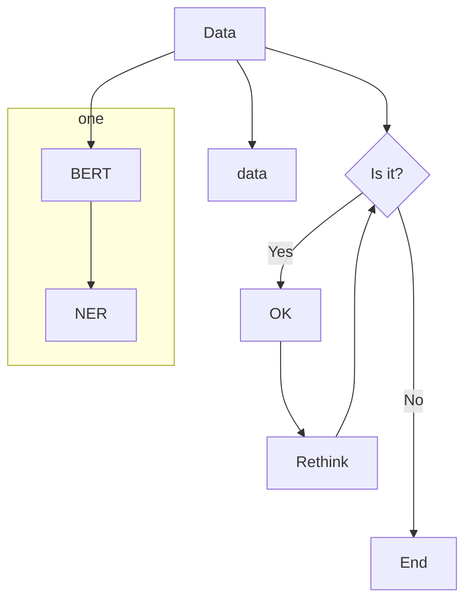

```mermaid
graph TD
    A[Data] --> B{Is it?};
    A-->data
            B -->|Yes| C[OK];
    subgraph one 
    BERT --> NER 

    end
    A --> BERT 
    C --> D[Rethink];
    D --> B;
    B ---->|No| E[End];
```