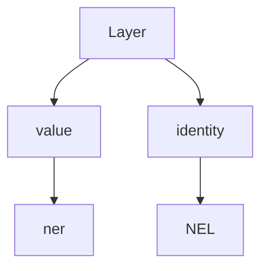
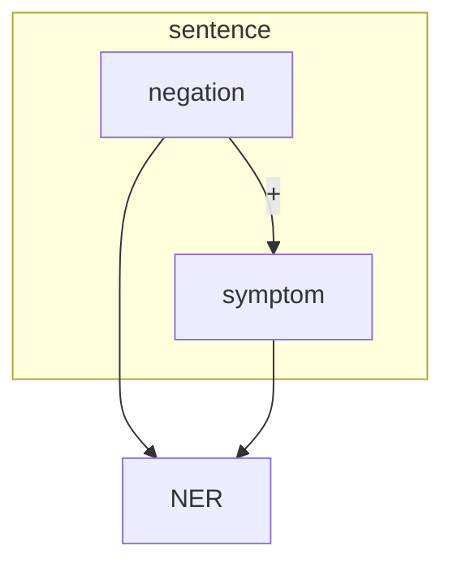

```mermaid
graph TD
l[Layer] --> value --> ner
l --> identity --> NEL
```

All data kommmer var txt 

Lund AIR filer finns i olika typer

identifiera negations

```mermaid
graph TD
subgraph sentence
neg[negation]
s[symptom]
end
n[NER] 
neg[negation] --> n
s --> n
neg -- + --> s

```

## 

