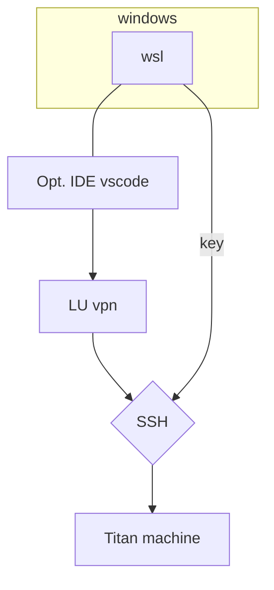
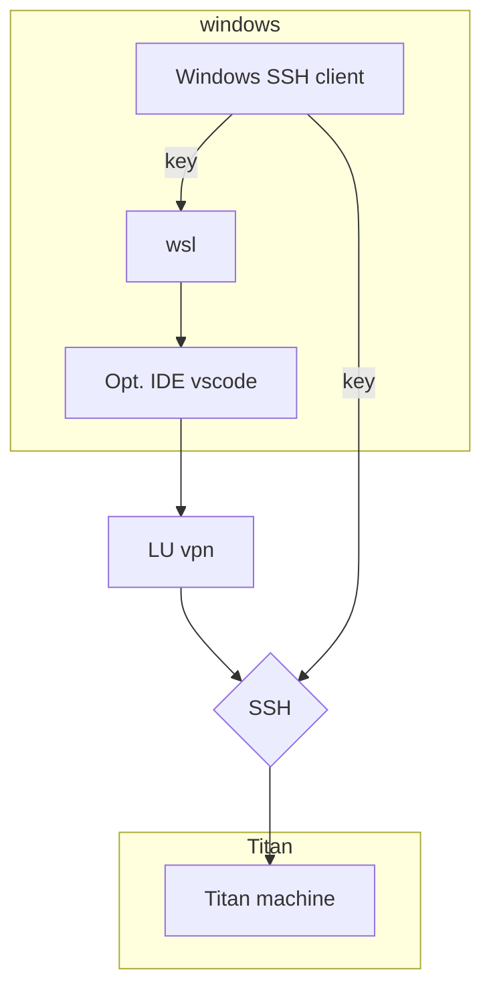

- [before](#before)
- [15/12/20](#151220)
- [16-12-20](#16-12-20)

# before
* NLP crash course
* Setup of code environment
* Learning 
  * git
  * SpacePy
  * misc (SSH, jupyter...)
* Testing the annotation software INCEpTION for usage, import and export capabilities and usage of external recommenders. [Se INCEpTION_usage_guide](/carl/INCEpTION/INCEpTION_project_guide.md) for results. 

**Issues:** 
Neither GitHub nor nbviewer renders created ipynb file. GitHub: "Sorry, something went wrong. Reload?
Steps:
Checked for any naming requirements
Looked at other ipynb files in the repository and had the same problem with some of them
The ones working and not seem consitent on reload and also viewing after some time
Answers online present no solution
Next: Vill check some more about useage of github and otherwise ask Sonja at meeting tomorrow. 
  
# 15/12/20

**Aim:** 

* Setup virtualenv for python in wsl
* Set up SSH connection to Lund AIRs remote computer 
    * check for usage across devices and wsl
* Define privacy protocol for file handling in project
* Start INCEpTION guide and questions base. Important to look at how to handle: Backup and file usage if INCEpTION is broken

**Result:** 

* Set up working connection to SSH-tunnel with help from Anders and tested the machine
* We also set up accessability through vscode remote as it is my normal IDE

* Looked at INCEpTION workflow and user structure and also security structure (found how to make these really handy graphs to help in creatning an overview)
* Started INCEpTION guide and also setup document for workflow, user and sercurity  structure.
* Properly set up python environment for project

***Extras***
* looked into markup so that I can't do more effective documentation, also switched logbook to be markdown as jupyter was to slow 

***Issues:*** 

* LU VPN seems unstable, breaks about every 30 machine
* SSH passphrase has to be entered at all new request 

**Next step:**
* Meeting with Johanna and Sonja tomorrow
  * Show Titan machine and usage 
  * Show INCEpTION workflow and user structure and talk about options
  * Look into timeline 
  * backups
* Test other client for vpn stability 
* Setup SSH agent autentiator in windows to give SSH key to wsl --> hopefully only enter passphrase only once

* Ask Sonja if markdown logbook works as well. Otherwise it can be converted to jupyter later **look into how to keep the formatting in such a case**
* Setup report so that it can easily be done in parallell - word in vscode?
# 16-12-20
