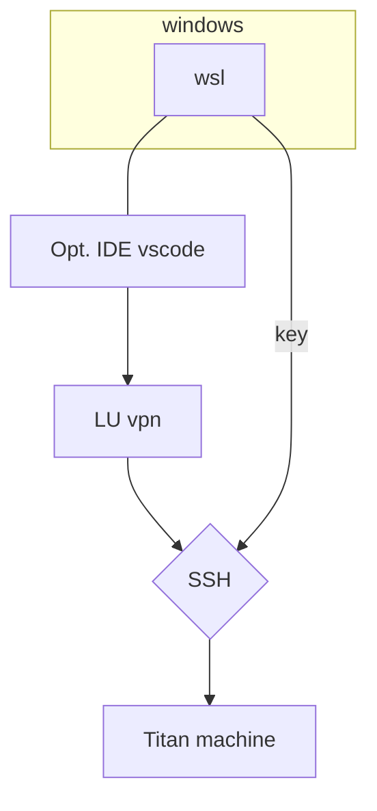
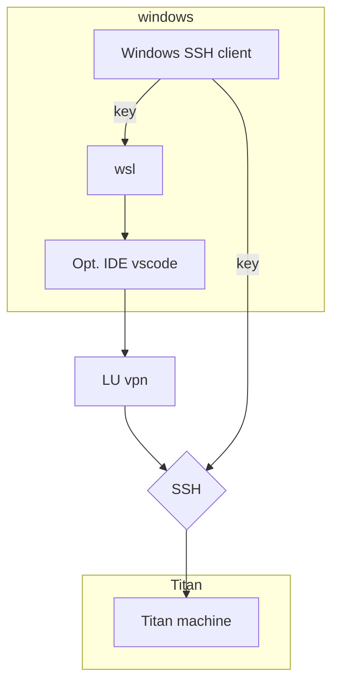
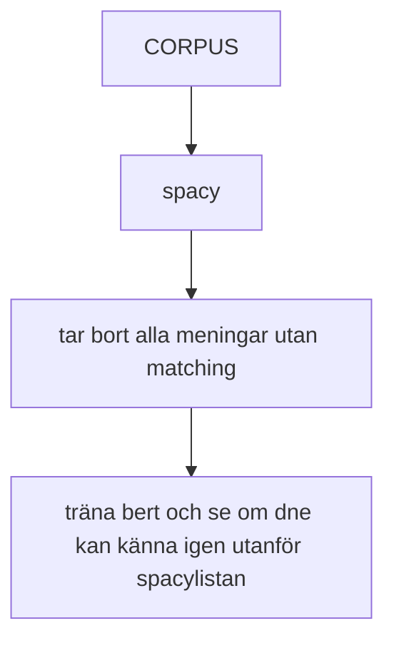
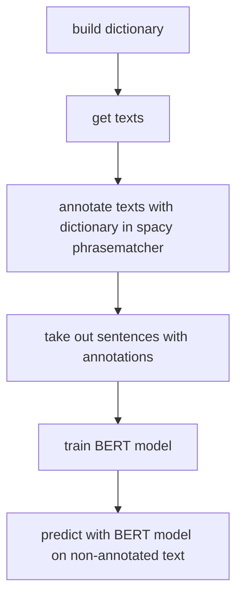

# logbook

This is the logbook

- [logbook](#logbook)
  - [before](#before)
  - [15/12/20](#151220)
  - [16/12/20](#161220)
  - [18/01/21](#180121)
  - [Day template](#day-template)

## before

- NLP crash course
- Setup of code environment

* Learning
  - git
  - SpacePy
  - misc (SSH, jupyter...)
* Testing the annotation software INCEpTION for usage, import and export capabilities and usage of external recommenders. [Se INCEpTION_usage_guide](/carl/INCEpTION/INCEpTION_project_guide.md) for results.

**Issues:**
Neither GitHub nor nbviewer renders created ipynb file. GitHub: "Sorry, something went wrong. Reload?
Steps:
Checked for any naming requirements
Looked at other ipynb files in the repository and had the same problem with some of them
The ones working and not seem consitent on reload and also viewing after some time
Answers online present no solution
Next: Vill check some more about useage of github and otherwise ask Sonja at meeting tomorrow.

## 15/12/20

**Aim:**

* Setup virtualenv for python in wsl
* Set up SSH connection to Lund AIRs remote computer
  * check for usage across devices and wsl
* Define privacy protocol for file handling in project
* Start INCEpTION guide and questions base. Important to look at how to handle: Backup and file usage if INCEpTION is broken

**Result:**

* Set up working connection to SSH-tunnel with help from Anders and tested the machine
* We also set up accessability through vscode remote as it is my normal IDE

* Looked at INCEpTION workflow and user structure and also security structure (found how to make these really handy graphs to help in creatning an overview)
* Started INCEpTION guide and also setup document for workflow, user and sercurity  structure.
* Properly set up python environment for project

***Extras***

* looked into markup so that I can't do more effective documentation, also switched logbook to be markdown as jupyter was to slow

***Issues:***

* LU VPN seems unstable, breaks about every 30 machine
* SSH passphrase has to be entered at all new request
* gitignore pattern didn't work properly

**Next step:**

* Meeting with Johanna and Sonja tomorrow
  * Show Titan machine and usage
  * Show INCEpTION workflow and user structure and talk about options
  * Look into timeline
  * backups
* Test other client for vpn stability
* Fix gitignore to ignore foo* files
* Setup SSH agent autentiator in windows to give SSH key to wsl --> hopefully only enter passphrase only once

* Ask Sonja if markdown logbook works as well. Otherwise it can be converted to jupyter later **look into how to keep the formatting in such a case**
* Setup report so that it can easily be done in parallell - word in vscode?

## 16/12/20

1[build dictionary]
2[get texts]
3[annotate texts with dictionary in spacy phrasematcher]
4[take out sentences with annotations]
5[train BERT model]
6[predict with BERT model on non-annotated text]

build dictionary
get texts
annotate texts with dictionary in spacy phrasematcher
take out sentences with annotations
train BERT model
predict with BERT model on non-annotated text

build dictionary
get texts
annotate texts with dictionary in spacy phrasematcher (alternative: annotate texts manually)
take out sentences with annotations
train BERT model (alternative: train spacy model)
evaluate BERT model on manually annotated text
predict with BERT model on non-annotated text (alternative: predict with spacy model)

TExter nu om tillräckligt många så kan jag gå direkt till steg 5

6 behöver alltid manuell

## 18/01/21

**Aim:**

Möte med Johanna och Sonja för vidare planering efter jul och tentauppehåll.

**Result:**

- Johanna har möte på fredag för att se om hon manuellt kan ta ut 100 texter som hon kan annotera och som kan användas som facit för att testa den tränade modellen.
- Vi kommer inte att få tillgång till en större textsamling trots att etisk tillstånd finns eftersom regionen inväntar legalt beslut som kommmer att komma tidigast i mars.

***Extra***

- Martin kommer att kämpa för att kunna publicera dessa texter avindentifierade med rapport av projektet.

***Issues:***

**Next steps:**

- Exportera mockup-corpus från Johannas texter så att hon kolla fact-checka NER för symptom.
  - *Sonja* återkommer med format. Antagligen CoNLL 20XX.
- Skriv ner protokoll för metod
  - Formatera så att det går att uppdatera löpande och går att använda direkt till rapporten sen

**More Steps:**

- [Set up INCEpTION server to run with MySQL](https://inception-project.github.io/releases/0.17.4/docs/admin-guide.html#sect_home_folder). This is the recommended way to run a project except for testing.
  - It makes following options avaliable:
    - Backup (internal)
    - Enabeling API
    - External editing from others
  - > I might use docker for this - will however still require that I run my computer as a server. But could be useful to show things inside inception.
    >

## Day template

**Aim:**
**Result:**
***Extras***
***Issues:***
**Next step:**

## 02/02/21

**Aim:**
**Result:**

Symptoms what you can see

Heart palpitations but not high blood fats

In tirage you might not have the info. Pat might tell you or you might have documents, but not the most relevant for triage

Make sure to document all choices

Maybe create list with rules
***Extras***

Creating rasource corpus

*asking firends

*clear sym comorbidities

* thought diagnosis?

Sonja will ask at socialstyrelsen if there is a excel version 
***Issues:***
**Next step:**

Johannas Journals

Export and send tomorrow

Write 5 fake journals

What is hard in workflow

Use the already made symptom list with spacy phrasematcher and compare to manueally annotated. Add symptoms I annotated to the list -> should then pick up everything

Report following

FN; TN; FP; TP

Annotate on titans

Get bulk of text for newspaper

ICD10 Only avaliable in PDF 

Dictionary -> use that to train
